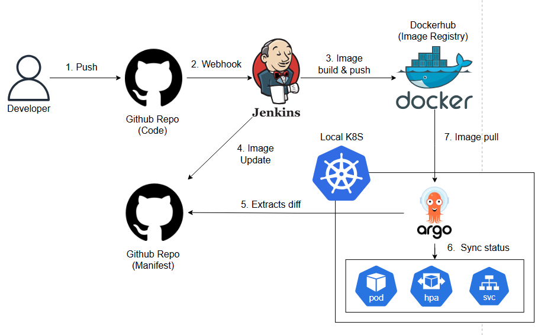
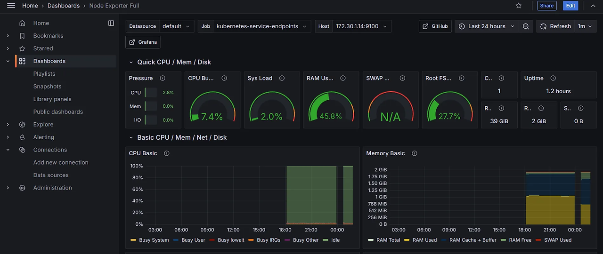
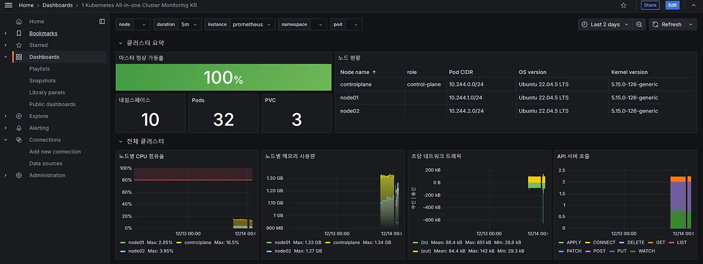
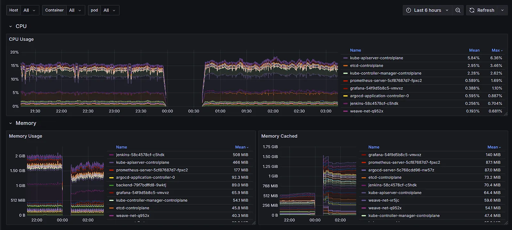

# Gitops
Local kubernetes에서 Jenkins와 argo cd 이용한 gitops 구축하고  
  
Prometheus와 Grafana를 이용하여 Monitoring 환경을 구축한다.  

CI CD 테스트 소스 코드는 Fastapi로 진행하였다.

자세한 개발 사항은 블로그에 적어놓았다.

---

## CICD  

[Jenkins CI 과정](https://dlwpdnr213.tistory.com/45)  

[Argocd CD 과정](https://dlwpdnr213.tistory.com/46)  

[Argocd Manifest Repo](https://github.com/Leejeuk213/argocd_yaml)  

  

---  

## Monitoring

[Monitoring 구축 과정](https://dlwpdnr213.tistory.com/47)  

  

    

    

